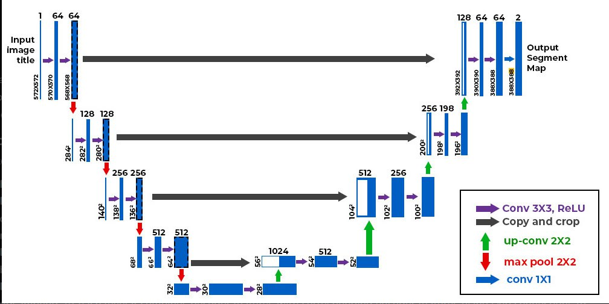

# **Diffusion Model for MNIST Digit Text to Image Generation**
This project implements a conditional diffusion model to generate MNIST digits using PyTorch. The model is based on a U-Net architecture and incorporates conditional embeddings for time steps and class labels.



## **Features**
* Conditional U-Net architecture for digit generation.
* Linear beta scheduler for noise addition and reverse diffusion.
* Training loop with periodic model saving.
* Image generation for specific digit labels using reverse diffusion.

## **Requirements**
* Python 3.8+
* PyTorch
* torchvision
* matplotlib
* numpy
Install the dependencies using:
```
pip install -r requirements.txt
```

## **How to Run**
1. Clone the repository
2. Run the training script:
```
python main.py
```
The model will train on the MNIST dataset and periodically save checkpoints.

3. View generated images: During training, images for the digit 3 will be generated and displayed every 10 epochs.

## **Model Architecture**
The conditional U-Net includes:

* Time embedding for timestep conditioning.
* Label embedding for class conditioning.
* Downsampling and upsampling paths with skip connections.
